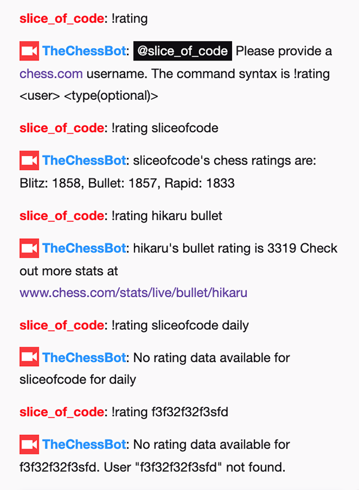
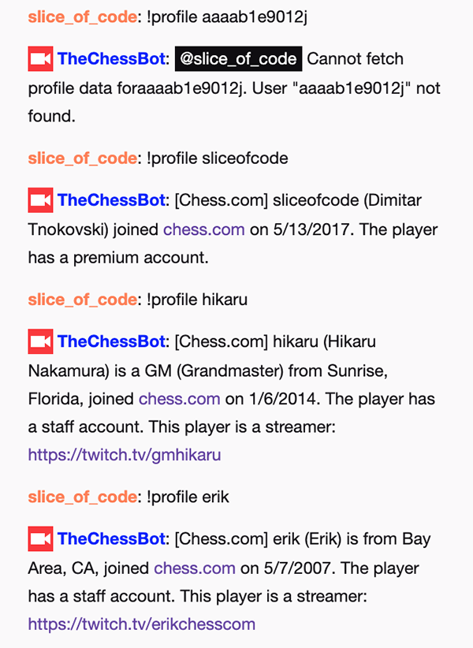
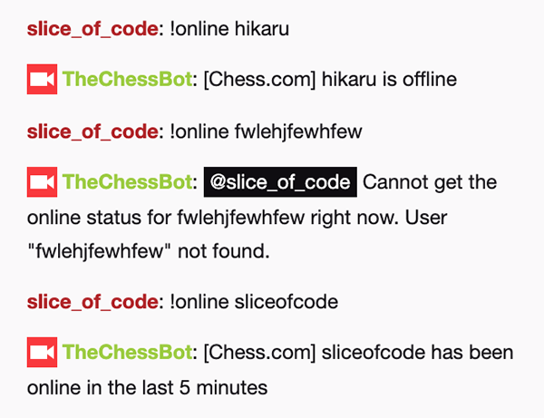

# Chess Twitch Bot

Open source twitch bot which allows querying the Chess.com's Published-Data API.

Currently this bot is under active development and very immature. 

The plan is to implement as much commands as possible by using the Chess.com's API and then provide _**free**_ 
hosted service for the bot where the streamer will just do a few clicks to configure it and make it join their channel.
 
## Chat, Support and Ideas
You can reach out to me via:
- Email: `dimitar@sliceofcode.com`
- Discord: https://discord.gg/26kwx8S
- Twitch Whisper: `slice_of_code`

## Screenshots




## Commands
- !help
- !rating \<user>
- !rating \<user> \<type>
- !profile \<user>
- !online \<user>

## Development Setup
Make sure you have NodeJS 10.15 installed (and commands `node`, `npm` and `npx` work in your terminal).
You can create a new username on Twitch, or use your existing one to test this out.

1. Clone this repository (use `master` branch for non-development purposes)
1. Copy `config/config.example.json` to `config/config.json` and edit the `CHANGEME` values in the file
1. Set the channel name in the `channels` array to be your Twitch username prefixed by `#`.
1. Set the `identity.username` value to be your Twitch username.
1. Log in on Twitch, go to https://twitchapps.com/tmi/ and click on the "Connect with Twitch" button. 
This will generate a password which looks like `oauth:aaabbbcccdddeeefffggghhhiiihhh`. 
Set that as the `identity.password` value.
1. Open the Terminal, and run the following command to build the bot: `npm install`
1. Execute the command `npm start` to run the chess twitch bot
1. Open your Twitch channel in the browser and check out the bot commands! :)

## Config Example
Example for the minimal config (`config/config.json`) required considering Twitch username is "ChessTwitchBot": 

```
{
  "channels": [
    "#ChessTwitchBot"
  ],
  "identity": {
    "username": "ChessTwitchBot",
    "password": "oauth:aaabbbcccdddeeefffggghhhiiihhh"
  }
}
```


## Reference
- Chess.com Published-Data API
  - https://www.chess.com/news/view/published-data-api
- TwitchJS - A community-centric, community-supported version of tmi.js 
  - https://github.com/twitch-devs/twitch-js

## License
MIT License

Twitch Chess Bot (twitch-chess-bot) is not affiliated, associated, authorized, endorsed by, or in any way officially
connected with Twitch, Chess.com or any of their subsidiaries or affiliates. 
The name "Twitch" as well as related names, marks, emblems and images are registered trademarks of Twitch. 
The name "Chess.com" as well as related names, marks, emblems and images are registered trademarks of Chess.com.